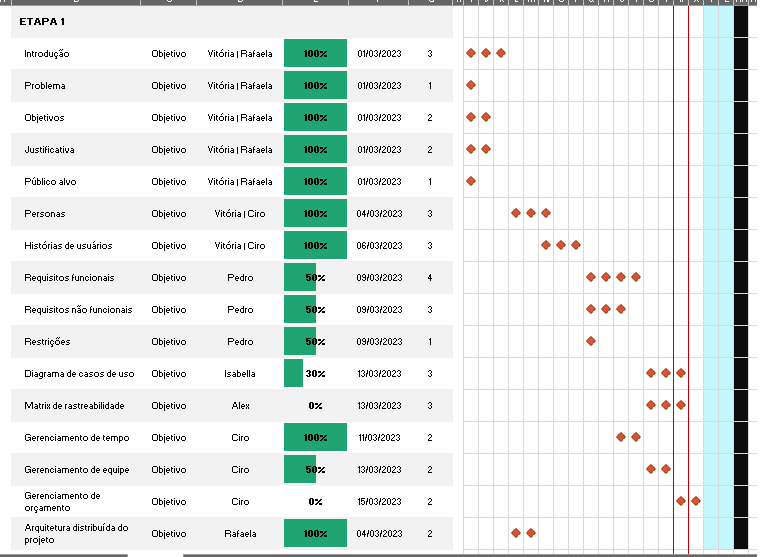
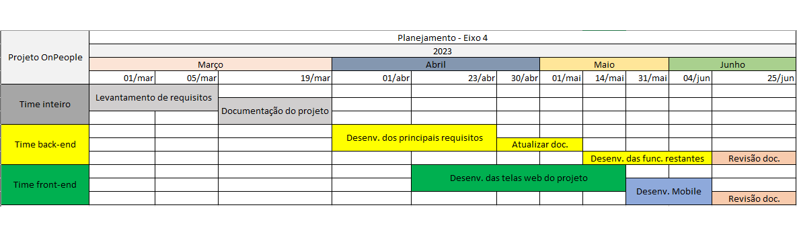
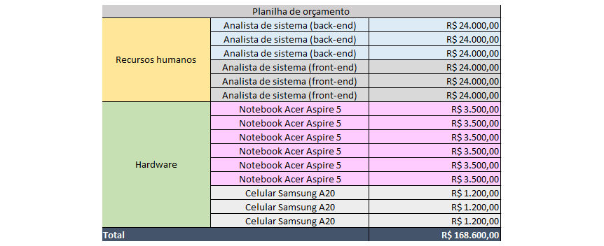

# Especificações do Projeto

Pré-requisitos: <a href="1-Documentação de Contexto.md"> Documentação de Contexto</a>

Definição do problema e ideia de solução a partir da perspectiva do usuário. É composta pela definição do diagrama de personas, histórias de usuários, requisitos funcionais e não funcionais, além das restrições do projeto.

Apresente uma visão geral do que será abordado nesta parte do documento, enumerando as técnicas e/ou ferramentas utilizadas para realizar as especificações do projeto

## Personas

| Lucas de Oliveira Santos | Melissa Fernandes Santos | Lúcia de Medeiros Silva |
| ---        |    ----   |          --- |
| | |  |
| Idade: 32 anos  Ocupação: foi promovido a Gerente do setor de RH há aproximadamente 2 anos, trabalha na empresa Neskal do Brasil, uma multinacional de grande porte.| Idade: 22 anos  Ocupação: Estagiária do setor de RH na empresa Neskal do Brasil. Faz faculdade de Ciências Contábeis e obteve uma oportunidade de expressar seus conhecimentos contábeis, junto ao setor de RH.| Idade: 42 anos  Ocupação: Gestora de RH na empresa Neskal do Brasil. Faz o gerenciamento do time e atividades de RH.|
|Hobbies, História: Lucas sonha em revolucionar a relação funcionário x empregador e, para isso, dedica parte de seu tempo em estudo, pesquisas e treinamentos em inovações de RH.|Hobbies, História: Além de ser uma jogadora de vôlei e estudante, Melissa dedica uma fração do tempo em pesquisa e desenvolvimento interpessoal.|Hobbies, História: Lucia realiza um sonho de estudar e conhecer belas artes.|
|Motivações:  Lucas tem ótimas ideias de gerenciamento e controle da produção, bem como, a gestão de expectativas de carreira e motivacional.|Motivações:  Melissa está conhecendo o mercado de trabalho, e viu como um desafio a oportunidade de trabalhar na empresa de Lucas, pois conciliar contabilidade com RH será um desafio inovador para sua carreira.|Motivações:  Lúcia está na empresa há 10 anos e foi recentemente promovida à Gestora de RH. Está motivada com as ideias e metodologias de Lucas e está empenhada em fazer acontecer a inovação na empresa.|
|Frustrações:  Atualmente,Lucas tem dificuldades de acompanhar/avaliar as metas e os objetivos profissionais de cada funcionário, pois não possui uma ferramenta sistematizada que fornece dados estatísticos dos funcionários.|Frustrações:  Não domina a maratona de atividades do RH e precisa se orientar dentro da empresa, através de uma ferramenta de suporte e capacitação.|Frustrações:   A ausência de ferramentas sistematizadas de gestão de RH, onera seu tempo de pensamento inovador com funções operacionais de preenchimento de formulários de cadastros, envio e recebimento de malotes, dentre outras necessidades do setor.|

## Histórias de Usuários

Com base na análise das personas, foram identificadas as seguintes histórias de usuários:

|EU COMO... `PERSONA`| QUERO/PRECISO ... `FUNCIONALIDADE` |PARA ... `MOTIVO/VALOR`                 |
|--------------------|------------------------------------|----------------------------------------|
| Lucas	| Receber dados estatísticos de funcionários(metas atingidas, não atingidas e em atraso) | Analisar tendências, cumprimento das metas e atendimento aos objetivos.|
| Lucia | Estabelecer metas para cumprimento em curto, médio e longo prazo para departamento, individuais e RH | Melhoria contínua no desenvolvimento pessoal e profissional.|
| Melissa |Gostaria de fazer a gestão dos funcionários, permitindo que eles tenham uma conta própria no sistema para entrar, sair e manter estes dados. | Ter uma maior agilidade na gestão de pessoas.|
| Lucas |	Realizar cadastros de metas	| Controle de metas.|
| Lucia	| Gostaria de controlar as empresas com seus departamentos e cargos | Ter uma maior agilidade de gestão administrativa. |
| Lucia |	Acompanhar objetivos individuais | Garantir o aperfeiçoamento profissional de cada membro da equipe.|

## Modelagem do Processo de Negócio 

### Análise da Situação Atual

Apresente aqui os problemas existentes que viabilizam sua proposta. Apresente o modelo do sistema como ele funciona hoje. Caso sua proposta seja inovadora e não existam processos claramente definidos, apresente como as tarefas que o seu sistema pretende implementar são executadas atualmente, mesmo que não se utilize tecnologia computacional. 

### Descrição Geral da Proposta

Apresente aqui uma descrição da sua proposta abordando seus limites e suas ligações com as estratégias e objetivos do negócio. Apresente aqui as oportunidades de melhorias.

### Processo 1 – NOME DO PROCESSO

Apresente aqui o nome e as oportunidades de melhorias para o processo 1. Em seguida, apresente o modelo do processo 1, descrito no padrão BPMN. 

### Processo 2 – NOME DO PROCESSO

Apresente aqui o nome e as oportunidades de melhorias para o processo 2. Em seguida, apresente o modelo do processo 2, descrito no padrão BPMN.

## Indicadores de Desempenho

Apresente aqui os principais indicadores de desempenho e algumas metas para o processo. Atenção: as informações necessárias para gerar os indicadores devem estar contempladas no diagrama de classe. Colocar no mínimo 5 indicadores. 

Usar o seguinte modelo: 

Obs.: todas as informações para gerar os indicadores devem estar no diagrama de classe a ser apresentado a posteriori. 

## Requisitos

### Requisitos Funcionais

|ID    | Descrição do Requisito  | Prioridade |
|------|-----------------------------------------|----|
|RF-001| O sistema deverá permitir o Login de funcionários da empresa | ALTA | 
|RF-002| O sistema deverá permitir a recuperação de senha   | BAIXA |
|RF-003| O sistema deverá permitir o gerenciamento de usuários (CRUD) | ALTA | 
|RF-004| O sistema deverá permitir o gerenciamento de empresas (CRUD)   | ALTA |
|RF-005| O sistema deverá permitir o gerenciamento de funcionários (CRUD) | ALTA | 
|RF-006| O sistema deverá permitir o gerenciamento de departamentos   | ALTA |
|RF-007| O sistema deverá permitir o gerenciamento de salários e atualizações do mesmo | ALTA | 
|RF-008| O sistema deverá permitir o cadastro de novas metas   | ALTA |
|RF-009| O sistema deverá permitir a associação de metas aos funcionários | ALTA | 

### Requisitos Não Funcionais

|ID     | Descrição do Requisito  |Prioridade |
|-------|-------------------------|----|
|RNF-001| O sistema deve ser feito usando práticas de UX e IxD | ALTA | 
|RNF-002| O sistema deve ser disponibilizado publicamente no GitHub |  ALTA | 
|RNF-003| O sistema deve apresentar baixo tempo de resposta nas requisições (não superior a 3 segundos) | MÉDIA | 
|RNF-004| O sistema deve ser implementado em C# e Angular |  ALTA | 
|RNF-005| O sistema deve ser responsivo e compatível com os principais navegadores | MÉDIA | 
|RNF-006| O sistema deve possuir uma versão mobile |  ALTA | 

## Restrições

|ID| Restrição                                             |
|--|-------------------------------------------------------|
|01| O projeto deverá ser entregue até o final do EIXO-4 (01/2023) |
|02| Deve ser desenvolvido um módulo de backend em C#      |

## Diagrama de Casos de Uso

|ATOR|	DESCRIÇÃO|
|----|-----------|
| Usuário Comum | Ator que faz login, visualiza o cadastro feito pelo RH, atualiza dados cadastrais, visualiza metas definidas pelo RH, cadastra metas pessoais e realiza consultas.|
| Operacional RH | Ator que cadastra funcionários, associa e cadastra novas metas, atualiza o cadastro (departamento e cargos), não faz cadastros administrativos, mas faz cadastro de usuários e cria contas.|
| Gestão RH | Ator com o papel master. Cria departamentos, cria metas, cria cargos e salários, realiza cadastros administrativos ("faz tudo").|

|CASO DE USO|	DESCRIÇÃO|	RF|
|-|-|-|
|Realizar Login no Sistema| O Usuário Comum deve conseguir realizar login com suas credenciais no sistema.| RF01/RF02|
|Gerenciar Perfil| O Usuário Comum deve conseguir gerenciar o seu perfil (atualizar dados não críticos e alterar senha) (CRUD) |RF01/RF02/RF03|
|Gerenciar Metas| O Usuário Comum deve conseguir cadastrar e visualizar metas de auto aprimoramento| RF08|
|Realizar pesquisa de funcionários | O Usuário Operacional RH deve conseguir realizar consultas no sistema| RF05|
|Gerenciar Usuário Comum| O Usuário Operacional RH deve conseguir gerenciar Usuários Comuns (CRUD)| RF03|
|Gerenciar Departamentos e Cargos| O Usuário Operacional RH deve conseguir atualizar o cadastro de departamentos e cargos | RF06 |
|Associar Metas| O Usuário Operacional RH deve conseguir associar novas metas | RF09 |
|Cadastrar Funcionários| O Usuário Operacional RH deve conseguir cadastrar funcionários  | RF05 |
|Gerenciar empresas| O Usuário Gestão RH deve conseguir gerenciar empresas (CRUD)| RF04|
|Gerenciar Funcionários| O Usuário Gestão RH deve conseguir gerenciar funcionários (CRUD) | RF05 |
|Gerenciar salários |O Usuário Gestão RH deve conseguir gerenciar salários |RF07 |
|Cadastrar Metas| O Usuário Gestão RH deve conseguir cadastrar metas | RF08 |

## Representação Visual
 

# Matriz de Rastreabilidade

A matriz de rastreabilidade é uma ferramenta utilizada para facilitar a visualização de relacionamento entre requisitos e outros artefatos ou objetos, permitindo a rastreabilidade entre os requisitos e os objetivos de negócio. 

A matriz deve contemplar todos os elementos relevantes que fazem parte do sistema, conforme a figura meramente ilustrativa apresentada a seguir:

 
 Matriz de rastreabilidade 

# Gerenciamento de Projeto

## Gerenciamento de Tempo

O gráfico de Gantt ou Diagrama de Gantt também é uma ferramenta visual utilizada para controlar e gerenciar o cronograma de atividades de um projeto. Com ele, é possível listar tudo o que precisa ser feito para colocar o projeto em prática, dividir em atividades e estimar o tempo necessário para executá-las.

## Gerenciamento de Equipe

O gerenciamento adequado de tarefas contribuirá para que o projeto alcance altos níveis de produtividade. Por isso, é fundamental que ocorra a gestão de tarefas e de pessoas, de modo que os times envolvidos no projeto possam ser facilmente gerenciados. 

#### Time Back-End: 
* Alex de Souza Galdino
* Ciro Hideki Artiga Watanabe
* Pedro Luiz Braga Andrade Leite
* Rafaela Cristina Souza de Oliveira

#### Time Front-End: 
* Isabella Carolina de Almeida Siqueira Damião
* Vitória Gabriella Maffei Corrêa Rocha

## Gestão de Orçamento

O processo de determinar o orçamento do projeto é uma tarefa que depende, além dos produtos (saídas) dos processos anteriores, do gerenciamento de custos, e também de produtos oferecidos por outros processos de gerenciamento, como o escopo e o tempo.

